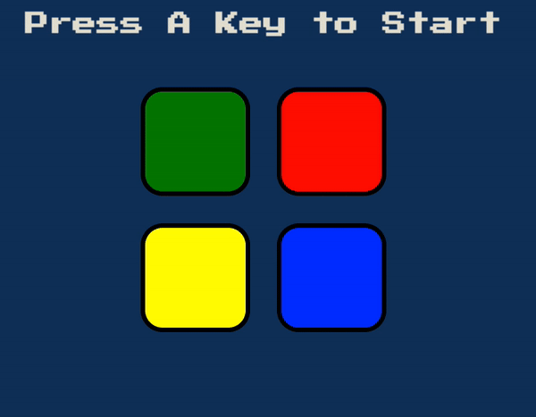

# Simon_Game

Firstly, the game shows the first colour in the sequence (blue). The user clicks on the blue button.

Next, the game shows the next colour (red), the user has to remember the sequence is blue, red and so on and so forth.

If the user messes up the sequence, then the game ends.

